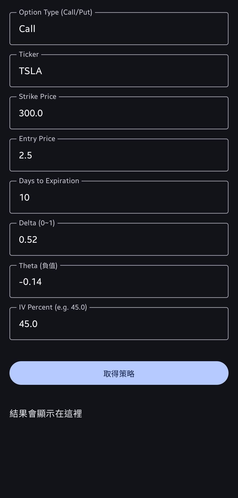
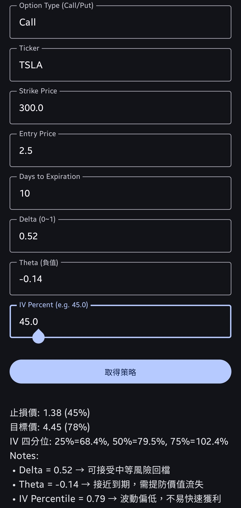

# Profit Targeter Android

> An Android app for automated options exit strategies (IV percentile, stop-loss & take-profit).

## Table of Contents

- [Features](#features)  
- [Screenshots](#screenshots)  
- [Backend API](#backend-api)  
- [Installation](#installation)  
  - [Download APK](#download-apk)  
  - [Build from Source](#build-from-source)  
- [Usage](#usage)  
- [Configuration](#configuration)  
- [Contributing](#contributing)  
- [License](#license)  

## Features

- 💹 Compute IV percentile using FastAPI + yfinance backend  
- 🛑 Auto-calculate stop-loss & take-profit points  
- 🔄 Dynamic UI built with Jetpack Compose  
- 📡 Network layer via Retrofit + Moshi  
- 🎨 Material3 design, loading indicators & error handling  

## Screenshots

<!-- Place your screenshots in `screenshots/` folder -->
  
  

## Backend API

This app talks to a FastAPI service deployed on Google Cloud Run:  
https://service-name-695533194214.europe-west1.run.app/
```  
Main endpoint:  
```
POST /generate_exit_strategy
```  
Example request body:
```json
{
  "symbol": "AAPL",
  "strike": 150.0,
  "daysToExpiry": 30
}
```

## Installation

### Download APK

Go to the [Releases](https://github.com/khuangtw/profit-targeter-android/releases) page and download the latest `profit-targeter-v1.0.0.apk`.  
1. On your Android device, enable “Install unknown apps” or “Allow from this source.”  
2. Open the APK to install and enjoy the app.

### Build from Source

```bash
# 1. Clone the repo
git clone https://github.com/khuangtw/profit-targeter-android.git
cd profit-targeter-android

# 2. Prepare keystore
#    Place profit-targeter.keystore into android/app/
#    Create keystore.properties in repo root:
#      storePassword=<your-keystore-password>
#      keyPassword=<your-keystore-password>
#      alias=profit-targeter

# 3. Build release APK
./gradlew clean
./gradlew assembleRelease

# 4. Signed APK is at:
#    android/app/build/outputs/apk/release/app-release.apk
```

## Usage

1. Launch the app  
2. Enter the symbol (e.g. `AAPL`), strike price, and days to expiry  
3. Tap **Calculate**  
4. View the IV percentile and suggested stop-loss / take-profit points  

## Configuration

If your backend URL changes, update it in your network module:

```kotlin
// In ApiClient.kt or NetworkModule.kt
private const val BASE_URL = "https://service-name-695533194214.europe-west1.run.app/"
```

## Contributing

1. Fork this repository  
2. Create a feature branch (`git checkout -b feature/YourFeature`)  
3. Commit your changes (`git commit -m "Add some feature"`)  
4. Push to the branch (`git push origin feature/YourFeature`)  
5. Open a Pull Request  

## License

Distributed under the MIT License. See [LICENSE](./LICENSE) for details.
